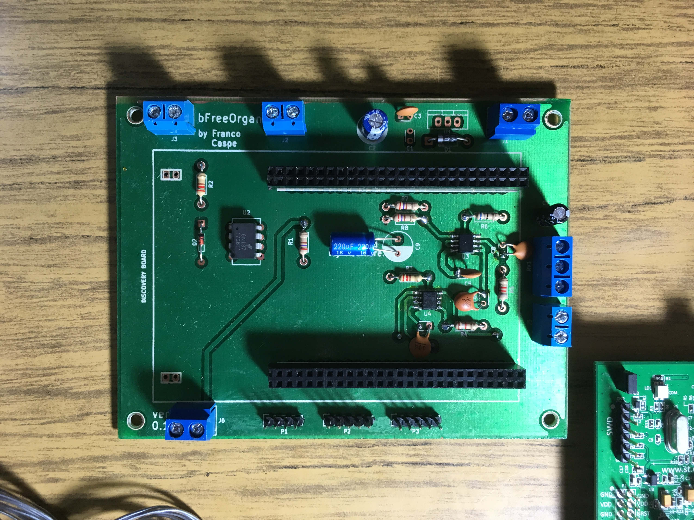
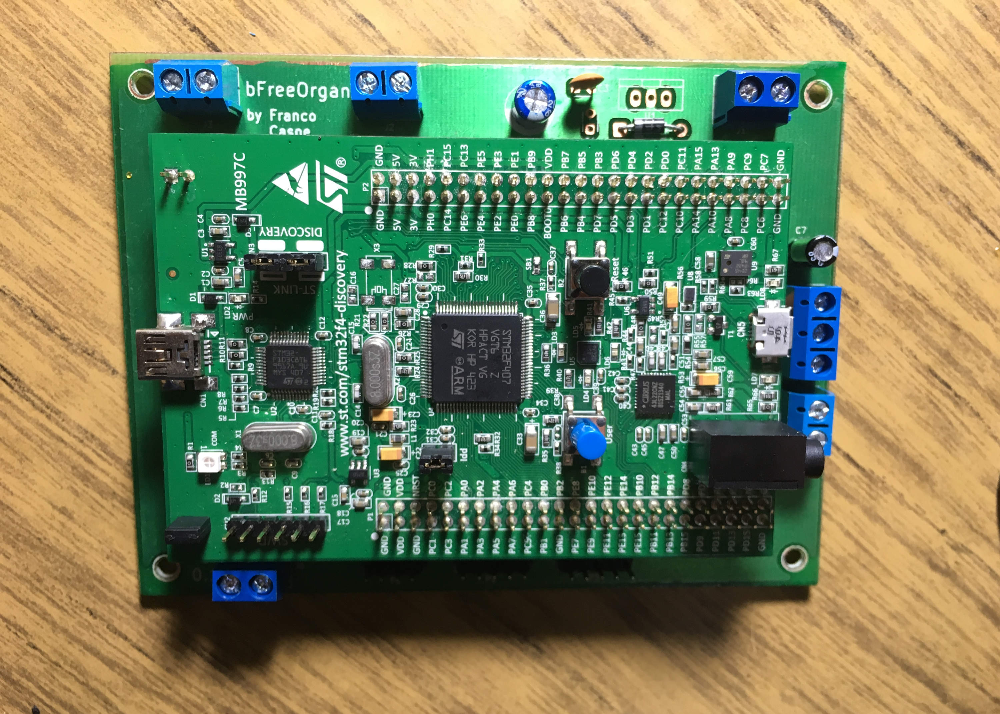
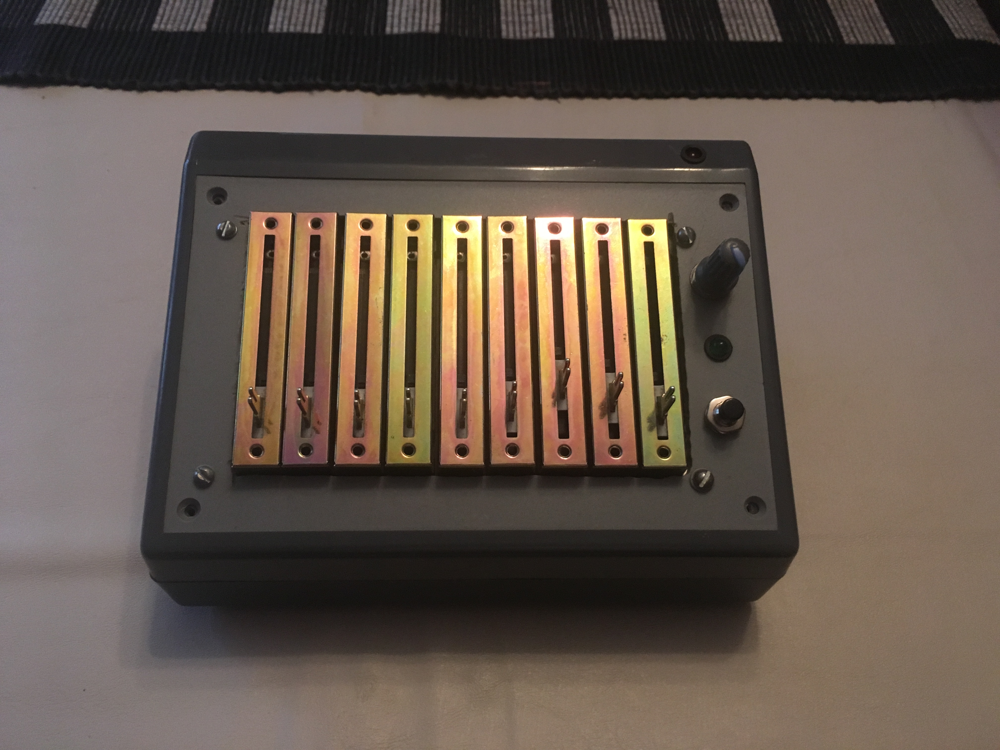
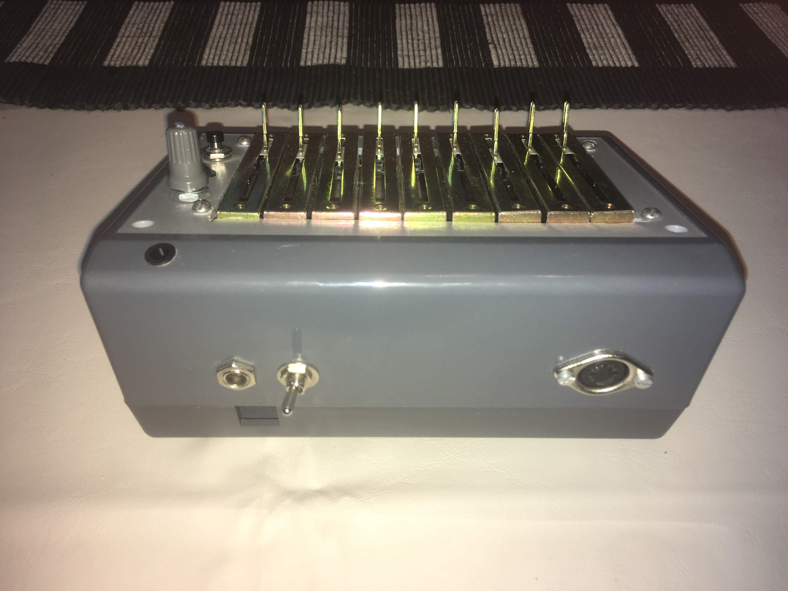
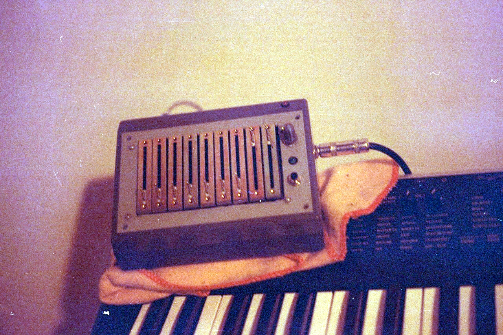

# bFreeOrgan
### A free Organ Synthesizer based on STM32F4.
**by Franco Caspe**

bFreeOrgan is an open source plattform for Additive Synthesis based on the well-regarded and low-cost Cortex M4 Microcontroller.
As of today, the plattform is used to implement a Synchronous Drawbar Organ Synthesizer that works with the STM32F407 Discovery board.
This project started in 2017, coded in C with ST Microelectronics Standard Peripheral Driver.

### Project state
This project is now IDE agnostic! Is built now with GNU make and arm gcc toolset.

[ARM GCC Toolset website](https://developer.arm.com/open-source/gnu-toolchain/gnu-rm/downloads)

For Flashing the discovery, the makefile uses texane/stlink tool. The latest version that is currently working fine for the STM32F4 Discovery board is 1.3.0.

[Texane's stlink utility](https://github.com/texane/stlink)

This repo currently contains the source and System Workbench project, KiCad project for the Main PCB and some calibration utils.
You can fancy your own drawbar controller (SEE PDF). 
3D Print Case is still pending! But, with a little creativity this project can be built! (see images)

### Building
Just make sure the arm-gcc toolset path is set in the PATH bash's enviroment variable when you run make.

1. Run: make
2. Connect the STM32F4 Discovery Board to the PC.
3. Run: make flash

### See it working!

[bFreeOrgan Prototype No.1](https://www.youtube.com/watch?v=Aql0KdO9ymM&t=1s)
### Some Images

Last Version PCB!

bFreeOrgan PCB with Discovery board mounted on.

Front Prototype Case

Rear Prototype Case

